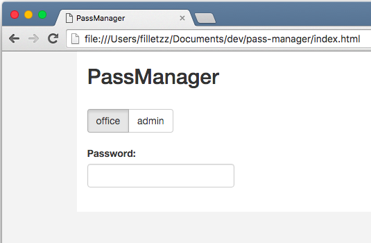
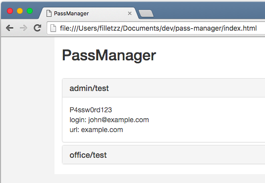

# PassManager
WebUI for [zx2c4 password manager](http://www.passwordstore.org/)

## Features

- Unlock all your pass files at once
- Support for more private keys (aka more users)
- Autolock after idle timeout

## Usage
- Clone the repository to folder where you have your .password-store and .gnupg
- Run `npm install`
- Specify all pass files that have to be decrypted in config files inside conf folder
- Set access permissions to 755 for all files inside .password-store and .gnupg folders
- Open index.html

## Warning

This script is not safe at all and propably have serious security issues. Use it only on localhost, never in open network! I take no responsibility for any damage caused by usage of this script.